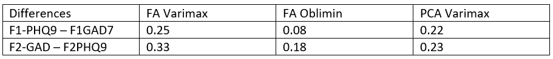

We load Libraries
```{r}
pacman::p_load(tidyverse, wesanderson, patchwork, psych, xlsx, RColorBrewer, GPArotation, ggcorrplot, ggpubr, bestNormalize, svglite)
```

We define a color palette for plots
```{r}
color_palette <- c(wes_palette("Chevalier1")[1], wes_palette("Darjeeling2")[2])
```


# Preprocessing 

We load the data into its raw format.
```{r}
data_raw <- read.csv("Data/ThisThat_Prolific2_2019_04_01_txt.csv", sep = ',', header = T,skip=1)
```

Load the data and tidy it: remove first row, filtering only finished trials, selecting and renaming columns.
```{r}
data <- data_raw

data <- data %>% 
  slice(-1) %>% 
  filter(Finished == 'True') %>% 
  select(6,9,14,15,17,19:ncol(data)) %>% 
  rename('Duration' = 'Duration..in.seconds.',
         'ID' = 'Response.ID',
         'Latitude' = 'Location.Latitude',
         'Longitude' = 'Location.Longitude',
         'Language' = 'User.Language',
         'Gender' = 'Please.indicate.your.gender',
         'Age' = 'Please.indicate.your.age',
         'Native_English' = 'Is.your.native.language.English.',
         'Native_Language' = 'What.is.your.native.language.',
         'Variety_English' = 'Which.variety.of.English.is.your.native.language....Selected.Choice',
         'Variety_English_Other' = 'Which.variety.of.English.is.your.native.language....Other..please.type.in.....Text') %>% 
  mutate_at(c('ID', 'Language', 'Gender', 'Age', 'Native_English', 'Native_Language', 'Variety_English', 'Variety_English_Other'), factor)
      


#For some reason the word "banjo" has snug in here and there
colnames(data)[c(42,273,189,210,249,270,309,330,369,390,429,450)]<- c('mushroom','hierarchy','bay','hall','arm','ham','banana','engineer','ant','handshake','axe','gratitude')

#Create a factor variable for the different groups and add it as a column to the data
wordGroup<-as.factor(rowSums(matrix(c(1*(data$helped!=''),2*(data$aggressive!=''),3*(data$activist!=''),4*(data$accordion!=''),5*(data$damaged!=''),6*(data$alligator!=''),7*(data$accident!=''),8*(data$actor!='')),ncol=8)))
data <- data %>% 
  mutate(Group = as.factor(wordGroup))

#drop levels
data<-droplevels(data)

```


We make a dataframe for the depression/anxiety/trait questions:
```{r}
data_pers <- data %>% 
  select(c(2,492:521))

#Rename some variables in the personality data frame
colnames(data_pers)[2:31] <- c('Pers01','Pers02','Pers03','Pers04','Pers05','Pers06','Pers07','Pers08','Pers09','Pers10','depr01','depr02','depr03','depr04','depr05','depr06','depr07','depr08','depr09','deprS','anx01','anx02','anx03','anx04','anx05','anx06','anx07','depr08r','depr09r','anxS')
```

We convert all the values into numbers and make a dataframe. 
```{r}
#scoring depression scores and anxiety scores from 0-3
data_depr_anx <- data_pers %>% 
  select(1, 12:20,22:28) %>% 
  mutate_all(as.factor) %>% 
  mutate_at(c(2:17),
              recode, 
             'Not at all'= 0,
             'Several days'= 1,
             'More than half of the days'= 2,
             'Nearly every day'= 3)


#We select the columns measuring personality traits. Odd number personality questions (question 9) are scored 1-7. Even number personality questions (question 4) are also scored 1-7. Note that this is different from what we did earlier. This is because we want these numbers to be directly comparable to the numbers from PHQ9 and GAD7. We set the numbers of personality question 4 so high scores equals high anxiety just like in the GAD7. And for personality question 9 we also put it in reverse so high scores mean 'not feeling calm and emotionally stable'.

data_trait <- data_pers %>% 
  select(1,5,10) %>% 
  mutate_all(as.factor) %>% 
  mutate_at('Pers09', 
            recode,
            'Disagree strongly'= 7,
            'Disagree moderately'= 6,
            'Disagree a little'= 5,
            'Neither agree nor disagree' = 4,
            'Agree a little' = 3,
            'Agree moderately' = 2,
            'Agree strongly' = 1) %>% 
  mutate_at('Pers04',
            recode,
            'Disagree strongly'= 1,
            'Disagree moderately'= 2,
            'Disagree a little'= 3,
            'Neither agree nor disagree' = 4,
            'Agree a little' = 5,
            'Agree moderately' = 6,
            'Agree strongly' = 7)


#We merge and also change the names of column/question
data_factor_an <- left_join(
  data_depr_anx,
  data_trait,
  by = 'ID') %>% 
  rename(
    'Little interest or pleasure in doing things'= 'depr01',
    'Feeling down, depressed or hopeless'='depr02',
    'Trouble falling asleep or sleeping too much'='depr03',
    'Feeling tired or having little energy'='depr04',
    'Poor appetite or overeating'='depr05',
    'Feeling bad about yourself or that you are a failure'='depr06',
    'Trouble concentrating'='depr07',
    'Moving/speaking slowly or being fidgety/restless'='depr08',
    'Suicidal/self-harm thoughts'='depr09',
    'Feeling nervous, anxious or on edge'='anx01',
    'Not being able to stop or control worrying'='anx02',
    'Worrying too much about different things'='anx03',
    'Trouble relaxing'='anx04',
    'Being so restless that it is hard to sit still'='anx05',
    'Become easily annoyed or irritable'='anx06',
    'Feeling afraid as if something awful might happen'='anx07',
    'Anxious and easily upset'='Pers04',
    'Not feeling calm and emotionally stable' ='Pers09')

#compute correlation matrix
data_factor_an_cor <- data_factor_an %>%
  select(c(2:19)) %>% 
  mutate_all( as.numeric)

#we scale all the values
data_factor_an_cor <- scale(data_factor_an_cor)
data_factor_an_cor <- as_tibble(data_factor_an_cor)

corr <- round(cor(data_factor_an_cor), 1)
  
```

# Correlation between PHQ9, GAD7 and neuroticism

```{r}
data_long <- read_csv('Data/data_long.csv')

#compute correlation matrix
data_long_cor <- data_long %>%
  select(PHQ9, GAD7, EmoStable) %>% 
  mutate_all( as.numeric)

#we scale all the values
data_long_cor <- scale(data_long_cor)
data_long_cor <- as_tibble(data_long_cor)

data_long_cor <- round(cor(data_long_cor), 1)

# Compute a matrix of correlation p-values
p_values <- cor_pmat(data_long_cor)

#png("figures/exploratory_factor_analysis/correlation_matrix_small.png", width = 10, height = 10, units = 'in', res = 300)

ggcorrplot(data_long_cor,
           hc.order = TRUE,
           type = "lower",
           outline.color = "white",
           ggtheme = ggplot2::theme_minimal,
           colors = c("#6D9EC1", "white", "#E46726"),
           lab = TRUE,
           lab_size = 14,
           tl.cex = 26) +
  theme(legend.position = 'none')
#dev.off()

perscor <- cor(data_factor_an_cor)
det(cor(data_factor_an_cor))

```


# Correlation between questions

```{r}
# Compute a matrix of correlation p-values
p_values <- cor_pmat(data_factor_an_cor)

#png("figures/exploratory_factor_analysis/correlation_matrix.png", width = 10, height = 10, units = 'in', res = 300)
svglite("figures/exploratory_factor_analysis/correlation_matrix.svg", width = 10, height = 10)

ggcorrplot(corr,
           hc.order = TRUE,
           type = "lower",
           outline.color = "white",
           ggtheme = ggplot2::theme_minimal,
           colors = c("#6D9EC1", "white", "#E46726"),
           lab = TRUE,
           #lab_size = 8,
           tl.cex = 14) +
  theme(legend.position = 'none')
dev.off()

perscor <- cor(data_factor_an_cor)
det(cor(data_factor_an_cor))

```
Computing Mean and Std of correlations
```{r}
#computing mean and std of correlations
corr_t <- as_tibble(corr)

mean_c = list()
std_c = list()

col = 1
for (col in ncol(corr_t)){
  column = corr_t[, col]
  column = column[-1,]
  column = as.list(column)[[1]]
  mean = mean(column)
  std = std(column)
  print(mean)
  print(std)
  
  
  col = col+1
}


```


# 2 factors using varimax

Now lets do the factor analysis. We choose 2 factors. Rotate using varimax so the factors become more orthogonal (more distinguishable). We use principal axis factoring 'pa', since it doesnt assume normality of our data, and our data is far from normal. 
We could also set number of iterations to 1000, which will give us a confidence interval for each factor.

```{r}
factor_an_var <- fa(data_factor_an_cor, nfactors = 2 ,rotate = "varimax", fm="pa")
print(factor_an_var, cut=0.4, digits = 2)
```
We choose items based on factor loadings and cross-loadings. All items with a factor loading above 0.5 is kept. 
*Trouble relaxing*, *Becoming easily annoyed or irritable* and *Feeling afraid as if something awful might happen*  has a heavy cross-loadings so we remove those three items.

We also choose items based on h2. H2 is the % of item variance explained by all the factors. When choosing factor loadings > 0.5 we accept h2 > 0.25. All items have a h2 above 0.25 (seen in the column h2). 
  

We make a new factor analysis where the three items are removed:
```{r}
factor_an_var <- fa(data_factor_an_cor %>% select(-c('Trouble relaxing', 'Become easily annoyed or irritable', 'Feeling afraid as if something awful might happen')),
                    nfactors = 2 ,
                    rotate = "varimax",
                    fm="pa")

print(factor_an_var, cut=0.4, order=TRUE, digits = 2)
```
Looks better :)

 
We make a plot for factor loadings.
```{r}
#Make data frame of factor loadings for ggplot
loadings_fa = factor_an_var$loadings %>% matrix(nrow=nrow(factor_an_var$loadings)) %>% data.frame() %>% magrittr::set_names(c('F1', 'F2')) %>% mutate(Features = rownames(factor_an_var$loadings))

# Turn factors into long format
loadings_fa_long <- loadings_fa %>% 
  gather(c(1:2),
         key = 'factor', 
         value = 'loading',
         factor_key=TRUE)%>%
# 2. Arrange by
  #   i.  factor group (component)
  #   ii. bar height (weight)
  arrange(factor,loading, desc = F)  %>% 
  # 3. Add order column of row numbers
  mutate(order = 1:nrow(.))

#make the plots
f1_plot <- loadings_fa_long %>% 
  filter(factor == 'F1') %>%
  arrange(desc(loading)) %>% 
  #slice(1:8) %>% 
  filter(loading >= 0.5) %>% 
  ggplot() +
  aes(x = order, y = loading) +
  geom_bar(aes(fill = loading), stat = 'identity', width = 0.6) +
  labs(x='', y='Factor loadings') + 
  #geom_text(axis.text.x = element_text(angle = 90,size=12,hjust=1)) +
  scale_fill_distiller(palette = 'Blues',direction = 1)+# Add categories to axis
  scale_x_continuous(
    breaks = loadings_fa_long$order,
    labels = loadings_fa_long$Features,
    expand = c(0,0)
    ) + 
  theme_minimal() +
  theme(legend.position='none') + 
  #labs(title = 'Depression (0.59) [0.91]') +
  #labs(title = 'a) Depression') +
  ylim(0, 0.75) +
  coord_flip() +
  theme(axis.text.x = element_text(size=24), axis.title.x = element_text(size=24), axis.text.y = element_text(size=24))# + 
  #theme(text = element_text(family = "Calibri"))

f2_plot <- loadings_fa_long %>% 
  filter(factor == 'F2') %>%
  arrange(desc(loading)) %>% 
  #slice(1:8) %>% 
  filter(loading >= 0.5) %>% 
  ggplot() +
  aes(x = order, y = loading) +
  geom_bar(aes(fill = loading), stat = 'identity', width = 0.3) +
  labs(x='', y='Factor loadings')+
  #geom_text(axis.text.x = element_text(angle = 90,size=12,hjust=1)) +
  scale_fill_distiller(palette = 'Blues',direction = 1)+# Add categories to axis
  scale_x_continuous(
    breaks = loadings_fa_long$order,
    labels = loadings_fa_long$Features,
    expand = c(0,0)
    ) + 
  theme_minimal() +
  theme(legend.position='none') + 
  #labs(title = 'Anxiety (0.41) [0.88]') +
  #labs(title = 'b) Anxiety') +
  ylim(0, 0.75) +
  coord_flip() +
  theme(axis.text.x = element_text(size=27), axis.title.x = element_text(size=27), axis.text.y = element_text(size=27))# + 
  #theme(text = element_text(family = "Calibri"))
  

#png("figures/exploratory_factor_analysis/loadings_depr.png", width = 15, height = 10, units = 'in', res = 300)
#f1_plot
#dev.off()

#png("figures/exploratory_factor_analysis/loadings_anx.png", width = 15, height = 10, units = 'in', res = 300)
#f2_plot
#dev.off()


svglite("figures/exploratory_factor_analysis/loadings_depr_2.svg", width = 15, height = 10)
f1_plot
dev.off()


svglite("figures/exploratory_factor_analysis/loadings_anx_2.svg", width = 15, height = 10)
f2_plot
dev.off()


# +
  #plot_annotation(title='Item loadings with two factors using varimax')
                  #subtitle = 'Proportion explained shown in () \nChronbecks alpha shown in []')

#dev.off()
```
Now lets see some chronbecks alpha

We start by assigning questions with loadings greater than 0.5 to each of the three factors.
```{r}
F1 <- c('Feeling down, depressed or hopeless',
        'Little interest or pleasure in doing things',
        'Feeling tired or having little energy',
        'Feeling bad about yourself or that you are a failure',
        'Trouble falling asleep or sleeping too much',
        'Poor appetite or overeating',
        'Trouble concentrating',
        'Suicidal/self-harm thoughts',
        'Moving/speaking slowly or being fidgety/restless',
        'Being so restless that it is hard to sit still')

F2 <- c('Not being able to stop or control worrying',
        'Worrying too much about different things',
        'Anxious and easily upset',
        'Feeling nervous, anxious or on edge',
        'Not feeling calm and emotionally stable')


```


Cronbecks alpha for the first factor. Alpha = 0.905 which is very good (almost too good). Corrected item-total correlations can be found in r.cor and they are all > 0.5 which is also good. 
```{r}
alpha_f1 = alpha(data_factor_an_cor[F1])
print(alpha_f1, digits = 3)
```

Cronbecks alpha for the second factor. Alpha = 0.877 which is very good (almost too good). Corrected item-total correlations can be found in r.cor and they are all > 0.5 which is also good. 
```{r}
alpha_f2 = alpha(data_factor_an_cor[F2])
print(alpha_f2, digits = 3)
```


# Comparing Varimax with oblimin and PCA

Making factor analysis with oblimin.
```{r}
factor_an_obl <- fa(data_factor_an_cor, nfactors = 2 ,rotate = "oblimin", fm="pa")
#print(factor_an_obl, cut=0.45, order=TRUE, digits = 2)
```

Making PCA and removing heavy cross-loadings
```{r}
pca_var <- psych::principal(data_factor_an_cor %>%
                              select(-c('Trouble relaxing', 'Become easily annoyed or irritable', 'Feeling afraid as if something awful might happen')), 
                            nfactors = 2,
                            rotate = "varimax")
#psych::print.psych(pca_var, cut = 0.4)
```


Computing scores for each rotation.
```{r}
data_depr_anx_scores <- data_pers %>% 
  select(1, 12:20,22:28) %>% 
  mutate_all(as.factor) %>% 
  mutate_at(c(2:17),
              recode, 
             'Not at all'= 0,
             'Several days'= 1,
             'More than half of the days'= 2,
             'Nearly every day'= 3) %>% 
  mutate(PHQ9 = rowSums(across(2:10)),
         GAD7 = rowSums(across(11:17)))

#emotionally stable scores
emostable <- read_csv('Data/data_long.csv') %>% select(ID, EmoStable) %>% distinct()


data_fa_2 <- tibble(ID = data$ID,
         F1_obl = factor_an_obl$scores[,1],
         F2_obl = factor_an_obl$scores[,2],
         F1_var = factor_an_var$scores[,1],
         F2_var = factor_an_var$scores[,2],
         P1_var = pca_var$scores[,1],
         P2_var = pca_var$scores[,2]
)

data_fa_2 <- left_join(data_fa_2,
                data_depr_anx_scores,
                by = 'ID') %>% 
  select(ID, F1_obl, F2_obl, F1_var, F2_var, P1_var, P2_var, PHQ9, GAD7)

data_fa_2 <- left_join(data_fa_2,
                       emostable, 
                       by = 'ID')
```


Looking at correlations between factor scores and PHQ9/GAD7.
```{r}
#compute correlation matrix
data_fa_2_cor <- data_fa_2 %>%
  select(c(2:10)) %>% 
  mutate_all(as.numeric) %>% 
  rename('Factor 1: Depression' = 'F1_var',
         'Factor 2: Anxiety' = 'F2_var',
         'Emotional Stability' = EmoStable)

#we scale all the values
#data_fa_2_cor <- scale(data_fa_2_cor)
#data_fa_2_cor <- as_tibble(data_fa_2_cor)

corr_obl <- round(cor(data_fa_2_cor %>% select(F1_obl, F2_obl, PHQ9, GAD7, EmoStable)), 2)
corr_var <- round(cor(data_fa_2_cor %>% select('Factor 1: Depression', 'Factor 2: Anxiety', PHQ9, GAD7, 'Emotional Stability')), 2)
corr_pca <- round(cor(data_fa_2_cor %>% select(P1_var, P2_var, PHQ9, GAD7, EmoStable)), 2)

var_cor <- ggcorrplot(corr_var,
           #hc.order = TRUE,
           type = "lower",
           outline.color = "white",
           ggtheme = ggplot2::theme_minimal,
           colors = c("#6D9EC1", "white", "#E46726"),
           lab = TRUE,
           lab_size = 8,
           tl.cex = 22) + 
  #labs(title = 'FA Varimax') + 
  theme(legend.position = 'none')

obl_cor <- ggcorrplot(corr_obl,w
           #hc.order = TRUE,
           type = "lower",
           outline.color = "white",
           ggtheme = ggplot2::theme_minimal,
           colors = c("#6D9EC1", "white", "#E46726"),
           lab = TRUE) + 
  labs(title = 'FA Oblimin') + 
  theme(legend.position = 'none')

pca_cor<- ggcorrplot(corr_pca,
           #hc.order = TRUE,
           type = "lower",
           outline.color = "white",
           ggtheme = ggplot2::theme_minimal,
           colors = c("#6D9EC1", "white", "#E46726"),
           lab = TRUE) + 
  labs(title = 'PCA Varimax') + 
  theme(legend.position = 'none')

#png("figures/exploratory_factor_analysis/uncorrelating_varimax.png", width = 10, height = 10, units = 'in', res = 300)
svglite("figures/exploratory_factor_analysis/uncorrelating_varimax.svg", width = 10, height = 12)
var_cor 
dev.off()
obl_cor
pca_cor

```
#### FA Varimax vs FA Oblimin

We see clear differences between factors and raw scores when comparing oblimin rotation to varimax rotation. 

F1 and F2: In oblimin, F1 and F2 are heavily correlated but in varimax they are weakly correlated. Thus, using varimax we can distinguish F1 and F2 a lot more clearly. 

Comparing F1-PHQ9 we see a slightly smaller correlation using varimax (0.98 and 0.94). Comparing F2-GAD7 we see a more substantial difference (0.95 and 0.77). We see that varimax makes factors more different from raw scores, especially for F2-GAD7.


#### FA Varimax vs PCA varimax

F1 and F2 vs P1 and P2: Using FA we have a small correlation between F1 and F2. WHen using PCA there is 0 correlation, which is due to the mechanics of PCA.

Comparing F1-PHQ9 and P1-PHQ9 (0.94, 0.90) we see that the first is more correlated with PHQ9. The same goes for F2-GAD7 and P2-GAD7 (0.81 0.62). 

#### Distinguishing depression and anxiety

Our goal is to distinguish depression and anxiety. In that regard, which method is the best? 

Below is a table of differences between the main scoring component and the secondary component. I.e. for F1, subtracting PHQ9 from GAD7, and vice versa for F2.

   


We see that FA varimax gives that largest differences between the main scoring component and the secondary component. *Thus, varimax is best at distinguishing depression and anxiety* 


Assigning a score to each individual and plotting some distributions.
```{r}
var_scores <- factor_an_var$scores %>% 
  as_tibble() %>% 
  gather(c(1:2),
    key = 'factor',
         value = 'value') %>% 
  ggplot() + 
  aes(x=value, fill = factor) + 
  geom_density() + 
  facet_wrap(~factor) +
  theme_minimal() + 
  theme(legend.position = 'none') + 
  labs(title = 'FA Varimax Rotation')

obl_scores <- factor_an_obl$scores %>% 
  as_tibble() %>% 
  gather(c(1:2),
    key = 'factor',
         value = 'value') %>% 
  ggplot() + 
  aes(x=value, fill = factor) + 
  geom_density() + 
  facet_wrap(~factor) +
  theme_minimal() + 
  theme(legend.position = 'none') + 
  labs(title = 'FA Oblimin rotation')

pca_scores <- pca_var$scores %>% 
  as_tibble() %>% 
  gather(c(1:2),
    key = 'factor',
         value = 'value') %>% 
  ggplot() + 
  aes(x=value, fill = factor) + 
  geom_density() + 
  theme_minimal() + 
  theme(legend.position = 'none') + 
  labs(title = 'PCA Varimax')


var_scores + obl_scores + pca_scores
```


# Saving 2 factor Varimax scores: making cut-off points for F1 and F2 and transforming to normality

## Cut off points

Saving the scores of F1 and F2 and merging with PHQ9 and GAD7. We also add cut off points based on the PHQ9 and GAD7 scores.
```{r}
#saving scores from FA
data_fa_2_varimax <- tibble(ID = data$ID,
         F1 = factor_an_var$scores[,1],
         F2 = factor_an_var$scores[,2])

#Calculating PHQ9 and GAD7 and adding binary indicators for depressed and anxiety 
data_depr_anx_g <- data_depr_anx %>% 
  mutate(PHQ9 = rowSums(across(2:10)),
         GAD7 = rowSums(across(11:17))) %>% 
  select('ID', 'PHQ9', 'GAD7') %>% 
  mutate(Depressed = case_when(PHQ9>10 ~ 1, # Moderate + Moderately severe + Severe
                               PHQ9<=10 ~ 0), # None + Mild
         Depressed = as.factor(Depressed),
         Depressed = fct_relevel(Depressed, '1','0'),
         
         Anxiety = case_when(GAD7>8 ~ 1,
                             GAD7<= 8 ~ 0),
         Anxiety = as.factor(Anxiety),
         Anxiety = fct_relevel(Anxiety, '1','0'))

data_fa_2_varimax_cut <- left_join(data_fa_2_varimax,
                                   data_depr_anx_g,
                                   by = 'ID') 
```


So, how do we make cut-off points for depressed/no-depressed and anxious/no-anxious with these new scores?
Here we calculate the percentage of participants without depression/anxiety.
Then we find the n'th percentile. The nth percentile of an observation variable is the value that cuts off the first n percent of the data values when it is sorted in ascending order.
```{r}
#making some tables
data_fa_2_varimax_cut %>% count(Depressed)
data_fa_2_varimax_cut %>% count(Anxiety)

#calculating percentage non-depressed and non-anxiety
prop_non_depr <- (data_fa_2_varimax_cut %>% count(Depressed))$n[2]/3014
prop_non_anx <- (data_fa_2_varimax_cut %>% count(Anxiety))$n[2]/3014

#find the percentile in F1 and F2 
quantile_depr <- quantile(data_fa_2_varimax_cut$F1, prop_non_depr) 
quantile_anx <- quantile(data_fa_2_varimax_cut$F2, prop_non_anx) 

#Adding depressed/non-depressed and anxiety/non-anxiety based on F1 and F2
data_fa_2_varimax_cut <- data_fa_2_varimax_cut %>% 
  mutate(Depressed_F1 = ifelse(F1 <= quantile_depr, 0, 1),
         Anxiety_F2 = ifelse(F2 <= quantile_anx, 0, 1))

```


Now lets make some plots. 
```{r}
depr_plot <- data_fa_2_varimax_cut %>% 
  ggplot() + 
  aes(x = factor(PHQ9)) +  
  geom_bar(aes(y = (..count..)/sum(..count..))) +
  geom_vline(xintercept = 10, color = 'red') + 
  theme_minimal() +
  labs(x="PHQ9", y="Percentage", title="Depression Score") + 
  scale_y_continuous(labels = scales::percent)

anx_plot <- data_fa_2_varimax_cut %>% 
  ggplot() + 
  aes(x = factor(GAD7)) +  
  geom_bar(aes(y = (..count..)/sum(..count..))) + 
  geom_vline(xintercept = 9, color = 'red') + 
  theme_minimal() +
  labs(x="GAD7", y="Percentage", title="Anxiety Score") + 
  scale_y_continuous(labels = scales::percent)


F1_plot <- data_fa_2_varimax_cut %>% 
  ggplot() + 
  aes(x=F1) + 
  geom_density() +
  geom_vline(xintercept = quantile_depr, color = 'red') +
  theme_minimal() + 
  theme(legend.position = 'none') + 
  labs(title = 'F1')

F2_plot <- data_fa_2_varimax_cut %>% 
  ggplot() + 
  aes(x=F2) + 
  geom_density() +
  geom_vline(xintercept = quantile_anx, color = 'red') +
  theme_minimal() + 
  theme(legend.position = 'none') + 
  labs(title = 'F2')

(depr_plot + anx_plot) / (F1_plot + F2_plot) + 
  plot_annotation(title='Distributions of Scores',
                  subtitle = 'Red line shows cut-off point')
```

## Transforming F1 and F2 to normality 

### bestNormalize Generic

```{r}
#qq
ggqqplot(data_fa_2_varimax_cut$F1)
ggqqplot(data_fa_2_varimax_cut$F2)

#shapiro test
shapiro.test(data_fa_2_varimax_cut$F1)
shapiro.test(data_fa_2_varimax_cut$F2)
```

I found a nice package called bestNormalize. It is quite good as it compares several methods of transformation and also it uses cv.
```{r}
F1_bestnormalize <- bestNormalize(data_fa_2_varimax_cut$F1, r = 20, k = 5)

F2_bestnormalize <- bestNormalize(data_fa_2_varimax_cut$F2, r = 20, k = 5)

F1_bestnormalize
F2_bestnormalize
```

```{r}
f1_ori_plot <- ggplot() + 
  aes(x=F1_bestnormalize$x, fill = color_palette[1]) + 
  geom_density() + 
  theme_minimal() + 
  theme(legend.position = 'none') + 
  labs(x = 'F1 (original)')

f1_trans_plot <- ggplot() + 
  aes(x=F1_bestnormalize$x.t, fill = color_palette[2]) + 
  geom_density() + 
  theme_minimal() + 
  theme(legend.position = 'none') + 
  labs(x = 'F1 (ordernorm transformation)')


f2_ori_plot <- ggplot() + 
  aes(x=F2_bestnormalize$x, fill = color_palette[1]) + 
  geom_density() + 
  theme_minimal() + 
  theme(legend.position = 'none') + 
  labs(x = 'F2 (original)')

f2_trans_plot <- ggplot() + 
  aes(x=F2_bestnormalize$x.t, fill = color_palette[2]) + 
  geom_density() + 
  theme_minimal() + 
  theme(legend.position = 'none') + 
  labs(x = 'F2 (ordernorm transformation)')


(f1_ori_plot + f1_trans_plot) / (f2_ori_plot + f2_trans_plot) + 
  plot_annotation(title='Before and After Transformation')
```

Predicted plots
```{r}
f2_predict_plot <- ggplot() + 
  aes(x=predict(F1_bestnormalize, data_fa_2_varimax_cut$F2[1508:3014]), fill = color_palette[2]) + 
  geom_density() + 
  theme_minimal() + 
  theme(legend.position = 'none') + 
  labs(x = 'F2 (predicted transformation)')

f1_predict_plot <- ggplot() + 
  aes(x=predict(F1_bestnormalize, data_fa_2_varimax_cut$F1[1508:3014]), fill = color_palette[2]) + 
  geom_density() + 
  theme_minimal() + 
  theme(legend.position = 'none') + 
  labs(x = 'F1 (predicted transformation)')
```


### bestNormalize boxcox


```{r}
boxcox_f1 <- boxcox((data_fa_2_varimax_cut$F1)+min_F1)

f1_ori_plot <- ggplot() + 
  aes(x=boxcox_f1$x, fill = color_palette[1]) + 
  geom_density() + 
  theme_minimal() + 
  theme(legend.position = 'none') + 
  labs(x = 'F1 (original)')

f1_trans_plot <- ggplot() + 
  aes(x=boxcox_f1$x.t, fill = color_palette[2]) + 
  geom_density() + 
  theme_minimal() + 
  theme(legend.position = 'none') + 
  labs(x = 'F1 (boxcox transformation)')

f1_ori_plot + f1_trans_plot
```

```{r}
ggqqplot(boxcox_f1$x)
ggqqplot(boxcox_f1$x.t)
ggqqplot(F1_bestnormalize$x.t)
```


### LOG

Now im gonna try log.
A common technique for handling negative values is to add a constant value to the data prior to applying the log transform. The transformation is therefore log(Y+a) where a is the constant. Some people like to choose a so that min(Y+a) is a very small positive number (like 0.001).
```{r}
#translating
min_F1 = abs(min(data_fa_2_varimax_cut$F1))+1
min_F2 = abs(min(data_fa_2_varimax_cut$F2))+1

#adding transformed values to dataframe
data_fa_2_varimax_cut <- data_fa_2_varimax_cut %>% 
  mutate(F1_log = log(F1+min_F1),
         F2_log = log(F2+min_F2))

#plotting
F1_plot <- data_fa_2_varimax_cut %>% 
  ggplot() + 
  aes(x=F1, fill = color_palette[1]) + 
  geom_density() +
  geom_vline(xintercept = quantile_depr, color = 'red') +
  theme_minimal() + 
  theme(legend.position = 'none')

transf1 <- data_fa_2_varimax_cut %>% 
  ggplot() + 
  aes(x=(F1+min_F1), fill = color_palette[1])+
  geom_density() + 
  geom_vline(xintercept = (quantile_depr+min_F1), color = 'red') +
  theme_minimal() + 
  theme(legend.position = 'none') + 
  labs(x = 'F1 (Translated)')

logf1 <- data_fa_2_varimax_cut %>% 
  ggplot() + 
  aes(x=F1_log, fill = color_palette[1])+
  geom_density() + 
  geom_vline(xintercept = log(quantile_depr+min_F1), color = 'red') +
  theme_minimal() + 
  theme(legend.position = 'none') + 
  labs(x = 'F1 (Log transformed)')

F2_plot <- data_fa_2_varimax_cut %>% 
  ggplot() + 
  aes(x=F2, fill = color_palette[1]) + 
  geom_density() +
  geom_vline(xintercept = quantile_anx, color = 'red') +
  theme_minimal() + 
  theme(legend.position = 'none')

transf2 <- data_fa_2_varimax_cut %>% 
  ggplot() + 
  aes(x=(F2+min_F2), fill = color_palette[1])+
  geom_density() + 
  geom_vline(xintercept = (quantile_anx+min_F2), color = 'red') +
  theme_minimal() + 
  theme(legend.position = 'none') + 
  labs(x = 'F2 (Translated)')

logf2 <- data_fa_2_varimax_cut %>% 
  ggplot() + 
  aes(x=F2_log, fill = color_palette[1]) +
  geom_density() + 
  geom_vline(xintercept = log(quantile_anx+min_F2), color = 'red') +
  theme_minimal() + 
  theme(legend.position = 'none') + 
  labs(x = 'F2 (Log transformed)')


(F1_plot + transf1 + logf1) / (F2_plot + transf2 + logf2) + 
  plot_annotation(title='F1 and F2 Transformation to normality: Translate, then Transform')
  

```

Checking normality of log transformation
```{r}
#qq
ggqqplot(data_fa_2_varimax_cut$F1_log)
ggqqplot(data_fa_2_varimax_cut$F2_log)

#shapiro test
shapiro.test(data_fa_2_varimax_cut$F1_log)
shapiro.test(data_fa_2_varimax_cut$F2_log)
```


## Transforming PHQ9 and GAD7 to normality

We also transform PHQ9 and GAD7 to normality. We might need them at some point. None of them are normal.
```{r}
#qq
ggqqplot(data_fa_2_varimax_cut$PHQ9)
ggqqplot(data_fa_2_varimax_cut$GAD7)

#shapiro test
shapiro.test(data_fa_2_varimax_cut$PHQ9)
shapiro.test(data_fa_2_varimax_cut$GAD7)
```

I found a nice package called bestNormalize. It is quite good as it compares several methods of transformation and also it uses cv.
```{r}
PHQ9_bestnormalize <- bestNormalize(as.numeric(data_fa_2_varimax_cut$PHQ9), r = 20, k = 5)

GAD7_bestnormalize <- bestNormalize(data_fa_2_varimax_cut$GAD7, r = 20, k = 5)

PHQ9_bestnormalize
GAD7_bestnormalize
```

```{r}
phq9_ori_plot <- ggplot() + 
  aes(x=factor(PHQ9_bestnormalize$x), fill = color_palette[1]) + 
  geom_bar() +
  theme_minimal() + 
  theme(legend.position = 'none') + 
  labs(x = 'PHQ9 (original)')

phq9_trans_plot <- ggplot() + 
  aes(x=PHQ9_bestnormalize$x.t, fill = color_palette[2]) + 
  geom_bar() +
  theme_minimal() + 
  theme(legend.position = 'none') + 
  labs(x = 'PHQ9 (ordernorm transformation)')


gad7_ori_plot <- ggplot() + 
  aes(x=GAD7_bestnormalize$x, fill = color_palette[1]) + 
  geom_bar() +
  theme_minimal() + 
  theme(legend.position = 'none') + 
  labs(x = 'GAD7 (original)')

gad7_trans_plot <- ggplot() + 
  aes(x=GAD7_bestnormalize$x.t, fill = color_palette[2]) + 
  geom_bar() +
  theme_minimal() + 
  theme(legend.position = 'none') + 
  labs(x = 'GAD7 (ordernorm transformation)')


(phq9_ori_plot + phq9_trans_plot) / (gad7_ori_plot + gad7_trans_plot) + 
  plot_annotation(title='Before and After Transformation')
```

## Saving target dataframe

Lastly we save the original scores, the transformed scores, F1_depressed, F2_anxiety PHQ9, GAD7 and depressed and anxiety for each participant. This dataframe will be our target dataframe. 
```{r}
target <- data_fa_2_varimax_cut %>% 
  select(-c('F1_translate', 'F1_log', 'F2_log')) %>% 
  mutate(F1_transformed = F1_bestnormalize$x.t,
         F2_transformed = F2_bestnormalize$x.t) %>% 
  relocate(ID, F1, F2, F1_transformed, F2_transformed, Depressed_F1, Anxiety_F2, PHQ9, GAD7, Depressed, Anxiety)

write.csv(target,"Data/target.csv", row.names = FALSE)
```


# 3 factors using varimax (Doesnt Work)

Now lets do the factor analysis. We choose 3 factors. Rotate using varimax so the factors become more orthogonal (more distinguishable). We use principal axis factoring 'pa', since it doesnt assume normality of our data, and our data is far from normal. 
We could also set number of iterations to 1000, which will give us a confidence interval for each factor.

```{r}
factor_an_var <- fa(data_factor_an_cor, nfactors = 3 ,rotate = "varimax", fm="pa")
print(factor_an_var, cut=0.4, digits = 2)
```
We choose items based on factor loadings and cross-loadings. All items with a factor loading above 0.5 is kept. 
*Trouble relaxing*, *Becoming easily annoyed or irritable* and *Feeling afraid as if something awful might happen*  has a heavy cross-loadings so we remove those three items.

We also choose items based on h2. H2 is the % of item variance explained by all the factors. When choosing factor loadings > 0.5 we accept h2 > 0.25. All items have a h2 above 0.25 (seen in the column h2). 
  

We make a new factor analysis where the three items are removed:
```{r}
factor_an_var <- fa(data_factor_an_cor %>% select(-c('Trouble relaxing', 'Become easily annoyed or irritable', 'Feeling afraid as if something awful might happen', 'Trouble concentrating', 'Suicidal/self-harm thoughts', 'Being so restless that it is hard to sit still')),
                    nfactors = 3 ,
                    rotate = "varimax",
                    fm="pa")

print(factor_an_var, cut=0.4, order=TRUE, digits = 2)
```
Looks better :)


Big ass plot
```{r}
#Make data frame of factor loadings for ggplot
loadings_fa = factor_an_var$loadings %>% matrix(nrow=nrow(factor_an_var$loadings)) %>% data.frame() %>% magrittr::set_names(c('F1', 'F2', 'F3')) %>% mutate(Features = rownames(factor_an_var$loadings))

# Turn factors into long format
loadings_fa_long <- loadings_fa %>% 
  gather(c(1:3),
         key = 'factor', 
         value = 'loading',
         factor_key=TRUE)%>%
# 2. Arrange by
  #   i.  factor group (component)
  #   ii. bar height (weight)
  arrange(factor,loading, desc = F)  %>% 
  # 3. Add order column of row numbers
  mutate(order = 1:nrow(.))

#make the plots
f1_plot <- loadings_fa_long %>% 
  filter(factor == 'F1') %>%
  arrange(desc(loading)) %>% 
  #slice(1:8) %>% 
  filter(loading >= 0.5) %>% 
  ggplot() +
  aes(x = order, y = loading) +
  geom_bar(aes(fill = loading), stat = 'identity') +
  labs(x='', y='Factor loadings')+
  #geom_text(axis.text.x = element_text(angle = 90,size=12,hjust=1)) +
  scale_fill_distiller(palette = 'YlOrRd',direction = 1)+# Add categories to axis
  scale_x_continuous(
    breaks = loadings_fa_long$order,
    labels = loadings_fa_long$Features,
    expand = c(0,0)
    ) + 
  theme(legend.position='none') + 
  labs(title = 'F1 (0.59) [0.91]') +
  ylim(0, 0.9) +
  coord_flip()

f2_plot <- loadings_fa_long %>% 
  filter(factor == 'F2') %>%
  arrange(desc(loading)) %>% 
  #slice(1:8) %>% 
  filter(loading >= 0.5) %>% 
  ggplot() +
  aes(x = order, y = loading) +
  geom_bar(aes(fill = loading), stat = 'identity') +
  labs(x='', y='Factor loadings')+
  #geom_text(axis.text.x = element_text(angle = 90,size=12,hjust=1)) +
  scale_fill_distiller(palette = 'YlOrRd',direction = 1)+# Add categories to axis
  scale_x_continuous(
    breaks = loadings_fa_long$order,
    labels = loadings_fa_long$Features,
    expand = c(0,0)
    ) + 
  theme(legend.position='none') + 
  labs(title = 'F2 (0.41) [0.88]') +
  ylim(0, 0.9) +
  coord_flip()

f3_plot <- loadings_fa_long %>% 
  filter(factor == 'F3') %>%
  arrange(desc(loading)) %>% 
  #slice(1:8) %>% 
  filter(loading >= 0.5) %>% 
  ggplot() +
  aes(x = order, y = loading) +
  geom_bar(aes(fill = loading), stat = 'identity') +
  labs(x='', y='Factor loadings')+
  #geom_text(axis.text.x = element_text(angle = 90,size=12,hjust=1)) +
  scale_fill_distiller(palette = 'YlOrRd',direction = 1)+# Add categories to axis
  scale_x_continuous(
    breaks = loadings_fa_long$order,
    labels = loadings_fa_long$Features,
    expand = c(0,0)
    ) + 
  theme(legend.position='none') + 
  labs(title = 'F3 (0.41) [0.88]') +
  ylim(0, 0.9) +
  coord_flip()

#png("figures/exploratory_factor_analysis/2_factors_var.png", width = 10, height = 12, units = 'in', res = 300)

f1_plot / f2_plot + f3_plot
  plot_annotation(title='Item loadings with two factors using varimax (cumulative variance = 0.54)',
                  subtitle = 'Proportion explained shown in () \n Chronbecks alpha shown in []')

#dev.off()
```

